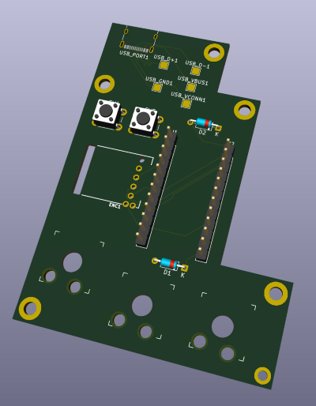

# RP2040 keyboard with Trackpoint and three buttons



## Layout

### Layer 1 

| Left key          | Middle Key  | Right key          | Left button                  | Right button               | Wheel up  | Wheel down  | Wheel click |
|-------------------|-------------|--------------------|------------------------------|----------------------------|-----------|-------------|-------------|
| Left mouse button | Scroll mode | Right mouse button | Volume down / Layer 3 (held) | Volume up / Layer 4 (held) | Scroll up | Scroll down | Layer 2     |

### Layer 2 (scroll pg up/dn)

| Left key          | Middle Key  | Right key          | Left button | Right button | Wheel up | Wheel down | Wheel click |
|-------------------|-------------|--------------------|-------------|--------------|----------|------------|-------------|
| Left mouse button | Scroll mode | Right mouse button | -           | -            | Page up  | Page down  | -           |

### Layer 3 (config 1)

| Left key      | Middle Key    | Right key   | Left button | Right button  | Wheel up  | Wheel down  | Wheel click |
|---------------|---------------|-------------|-------------|---------------|-----------|-------------|-------------|
| Default scale | Sniping scale | Scroll size | -           | Invert scroll | Adjust up | Adjust down | Dump config |

### Layer 4 (config 2)

| Left key       | Middle Key         | Right key         | Left button | Right button | Wheel up | Wheel down | Wheel click |
|----------------|--------------------|-------------------|-------------|--------------|----------|------------|-------------|
| Toggle sniping | Toggle drag scroll | Cycle scroll lock | Save        | -            | -        | -          | Reset       |

(Use scroll wheel to adjust scaling etc)

## Building firmware

Easiest is to use the supplied Makefile:

```sh
make -f keyboards/rosmo/Makefile
```

Keep right push button pressed to trigger Bootmagic.

## Hardware

- 6 buttons: 3 mouse buttons, scroll wheel click, 2 push-buttons for layers
- USB-C breakout

Horrible KiCad files available in [kicad/](kicad/).

3D printable case available in [case/](case/) (Adobe Fusion).

### Bill of Materials

| Reference   | Qty | Component                             |
|-------------|-----|---------------------------------------|
| D1,D2       | 2   | Diode 1N4148                          |
| ENC1        | 1   | Roller Encoder Panasonic EVQWGD001    |
| J1,J2       | 2   | 12 pin header 2.54mm pitch female     |
| SW1,SW2,SW3 | 3   | Low-profile hotswap keycap socket     |
| SW4,SW5     | 2   | Switch THT 6mm                        |
| USB_PORT1   | 1   | USB-C receptacle XKB-U262-16XN-4BVC11 |

+ USB-C connector module (male), plus some wire
+ [Holykeebs Trackpoint module](https://holykeebs.com/products/trackpoint-module)
